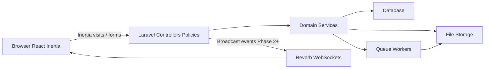

# SOFTWARE REQUIREMENTS SPECIFICATION (SRS)

**Project Name:** PLT Học Bá  
**Platform:** Web Application (Responsive)  
**Document Role:** Master blueprint for phased implementation on the existing Laravel React starter kit.

**Progress tracking:** Implementation status lives in [`PROGRESS.md`](./PROGRESS.md). Full docs map: [`README.md`](./README.md). Root agent entry: [`../AGENTS.md`](../AGENTS.md).

---

## 0. CURRENT CODEBASE BASELINE

This project is **not** a greenfield app. Implementation must extend the existing starter kit rather than replace it.

| Area | Current state |
|------|----------------|
| Framework | Laravel 13, PHP 8.3 |
| Frontend | Inertia.js React 3, React 19, TypeScript, Vite |
| UI | Tailwind CSS 4, shadcn/Radix (`resources/js/components/ui/*`) |
| Auth | Laravel Fortify (login, register, password reset, email verification) |
| Extra auth | Passkeys, Two-Factor Authentication |
| Routing helpers | Laravel Wayfinder (typed JS actions/routes under `resources/js/actions`, `resources/js/routes`) |
| App shell | Sidebar layout (`AppSidebar`, `AppShell`), settings pages, placeholder Dashboard |
| Domain models | `User` only (`name`, `email`, `password` + 2FA/passkey columns) |
| Social features | None yet (no posts, follows, likes, comments, notifications, chat) |
| Default runtime | SQLite; `CACHE_STORE=database`, `QUEUE_CONNECTION=database`, `BROADCAST_CONNECTION=log` |
| Tests / quality | Pest, Pint, PHPStan (Larastan), ESLint, Prettier |

**Do not** introduce Breeze, Jetstream, Blade SPA auth, or a separate React SPA API unless a later decision explicitly changes architecture.

---

## 1. INTRODUCTION

### 1.1. Purpose

Define architecture, functional requirements, data model, UI surfaces, and non-functional constraints for **PLT Học Bá** — a closed learning community for PLT Solutions members, built on the current codebase. This document guides AI-assisted and human development so generated code matches project conventions.

### 1.2. Product Goals

- Provisioned members can share knowledge, follow classmates, and consume a personalized feed.
- Engagement (likes, comments, notifications) supports learning discussion.
- The product is **not** a public social network: accounts are admin-provisioned (Phase 30); posts are reviewed before they go live (Phase 32).
- Delivery is phased to keep each increment testable and mergeable.

### 1.3. Target Audience & Roles

| Role | Description |
|------|-------------|
| **Guest** | Unauthenticated. May access welcome, login, password reset, and the closed register page. Cannot self-register (Phase 30; `FORTIFY_PUBLIC_REGISTRATION=false`). Cannot view feeds or profiles that require auth (Phase 1 default: social surfaces are auth-gated). |
| **User** | Authenticated, email-verified member. Creates posts, follows, engages, manages public profile and account settings. |
| **Administrator** | Elevated privileges to moderate content, manage users (including **create user**), and view basic system analytics. Implemented via a simple `role` (or equivalent) flag in Phase 1; expand later if needed. |

### 1.4. Out of Scope (All Phases Unless Explicitly Added Later)

- Mobile native apps
- Groups / communities / pages
- Stories / reels / short video
- Ads / monetization
- Public GraphQL API
- Multi-tenant organizations

---

## 2. TECHNOLOGY STACK (TARGET)

| Layer | Choice | Notes |
|-------|--------|-------|
| Backend | Laravel 13, PHP 8.3 | Keep existing app structure |
| HTTP UI | Inertia.js + React + TypeScript | Server-driven pages; prefer Inertia visits/forms over ad-hoc JSON APIs |
| Styling | Tailwind CSS 4 + existing shadcn components | Reuse `Button`, `Avatar`, `Dialog`, `Input`, etc. |
| Auth | Fortify (+ Passkeys, 2FA already present) | Extend registration/profile fields; do not replace Fortify |
| DB (dev default) | SQLite | Match `.env.example` for local |
| DB (prod target) | MySQL 8.0+ or PostgreSQL | Schema must remain portable (avoid SQLite-only features) |
| Files | Laravel filesystem (`local` → S3-compatible in prod) | Avatars, covers, post images |
| Queues | `database` in early phases; Redis driver when needed | Phase 3 media jobs |
| Cache | `database` early; Redis for feed cache in Phase 3 | |
| Realtime | Laravel Reverb + Echo (Laravel Echo / `@laravel/echo`) | Introduced in Phase 2 |
| Quality | Pest feature/unit tests, Pint, PHPStan, frontend lint/types | Required for each phase exit |

### 2.1. Architecture Style

**Conventions:**

- Controllers thin; validation in Form Requests; authorization in Policies.
- Domain logic in Services (e.g. `FeedService`) when queries/workflows grow beyond a controller action.
- Frontend pages under `resources/js/pages/`; shared UI under `resources/js/components/`.
- Prefer Wayfinder-generated route/action imports over hardcoded URL strings.
- Prefer Inertia partial reloads / form helpers for mutations; use small JSON endpoints only when necessary (e.g. like toggle without full page props churn).
- Eager-load relations with `with()`; forbid N+1 in feed/profile queries.

---

## 3. DEVELOPMENT ROADMAP

Development is strictly phased. **Do not implement later-phase features until the current phase is tested and accepted.**

| Phase | Theme | Exit criteria (summary) |
|-------|--------|-------------------------|
| **1** | Foundation & social graph | Auth extensions, profiles, posts CRUD, follows, newsfeed, basic admin role |
| **2** | Engagement & realtime | Likes, nested comments, DB + realtime notifications via Reverb |
| **3** | Advanced & scale | Multi-image posts + queued processing, 1:1 chat, search/explore, caching/indexes |
| **4** | Hardening | Rate limits, audit log, failed jobs, ops notes, admin dashboard polish |
| **5** | Engagement depth | Bookmarks, @mentions, post search tab |
| **6** | Hashtags | Tags, `/t/{slug}`, explore/search tags, `#` linkify |
| **7** | Ops | FULLTEXT, `MEDIA_DISK`, Horizon |
| **8** | UX foundation | Tokens, Facebook-like chrome, EmptyState/Skeleton, hide admin breadcrumbs |
| **9** | Post unit | PostCard, composer, media upload/carousel, edit form |
| **10** | Home feed | Density, empty CTA, load-more, skeletons |
| **11** | Profile | Cover/header, follow lists + row Follow, Message entry |
| **12** | Engagement UX | Post detail, comments, bell SSR, notifications, bookmarks |
| **13** | Discovery UX | Global search entry, search/explore/tags, right rail |
| **14** | Messaging UX | Messenger-like split pane, composer, start-chat UX |
| **15** | Guest / settings / admin | Branded welcome+auth, settings polish, admin confirms |
| **16** | Motion foundation | `motion` lib, tokens, MotionProvider, shimmer skeletons, reduced-motion |
| **17** | Motion interactions | Like/bookmark/composer/card/nav/dialog micro-interactions |
| **18** | Motion showcase | Welcome parallax, profile scroll, list stagger, messages, page fade |
| **19** | Messages UX depth | Full-width shell, auto-open latest, scroll/composer/inbox polish |
| **20** | Rich profile | Intro/About fields + per-field privacy, Photos tab, wider 2-col layout |
| **21** | Notification badges | Single unread source of truth; live Echo for notif + DM badges; mark-read on click |
| **22** | Emoji stickers | Picker + large emoji-only bodies |
| **23** | Post composer dialog | Hybrid create/edit dialog |
| **24** | Post reactions | Seven expressions; picker; `likes.type` |
| **25** | Mobile chrome foundation | Docs + create provider scaffolding (glass later abandoned) |
| **26** | Mobile chrome | Solid top/dock + Create FAB + shell padding |
| **27** | Mobile overlays + walk | Solid sheet composer; page fit (no glass) |
| **28** | Share post | Feed share + copy link + DM embed |
| **29** | Messages mobile UX | Inbox-first dock, immersive thread, keyboard/emoji |
| **30** | Admin-provisioned accounts | Lock public register; admins create users with a temporary password |
| **31** | Admin console layout | Separate admin sidebar shell; dashboard cards; searchable tables |

---

## 4. PHASE 1 — CORE FOUNDATION & SOCIAL GRAPH (MVP)

### 4.1. Objective

Establish identity fields needed for social UX, public profile surfaces, posting, follow graph, and a personalized newsfeed — on top of existing Fortify auth and Inertia shell.

### 4.2. Functional Requirements

#### 4.2.1. Authentication & Authorization (extend existing)

Already present (keep): login, logout, Fortify register routes, password reset, email verification, passkeys, 2FA, account settings (profile name/email, security, appearance).

**Add / change:**

- User model must include a **unique `username`** (slug-safe: lowercase alphanumeric + underscores; length limits documented in validation rules). Username is set when an admin creates the account (Phase 30) or on profile update.
- **Public self-registration is off by default** (`FORTIFY_PUBLIC_REGISTRATION=false`, ADR 0015). GET `/register` shows a closed page; POST `/register` is 403. Admins create members at `/admin/users` with a temporary password; new accounts are `role=user` and email-verified.
- Display name remains `name`.
- Guest access unchanged for login/reset; social app routes require `auth` + `verified` middleware (same pattern as current `dashboard`).
- Basic RBAC: `role` enum/string on `users` with values `user` | `admin` (default `user`).
- Admin capabilities in Phase 1 (minimum): list users, suspend/ban or soft-disable user, delete any post. Full analytics UI may be stubbed. Phase 30: create user.

#### 4.2.2. User Profile Management

- Public profile page by username: `/u/{username}` (or equivalent named route).
- Profile displays: avatar, cover photo, name, `@username`, bio (max 160 chars), join date, followers count, following count, user’s posts (paginated).
- Owner can update: name, username (with uniqueness + cooldown optional), bio, avatar, cover from settings and/or profile edit UI.
- Avatar/cover stored on filesystem disk; serve via storage route or public disk URL.
- Extend existing settings profile page and/or add social profile fields without breaking Fortify email verification flow.

#### 4.2.3. Post System (CRUD)

- Create post: text body max **2000** characters; optional **single** image (Phase 1).
- Validation: empty body not allowed unless image present (or require body — pick one rule and enforce consistently; **default: body required**, image optional).
- Edit/delete: only author (Policy). Admin may delete any post.
- Profile shows author’s posts, newest first, paginated.
- Soft deletes optional but recommended for moderation (`deleted_at`).

#### 4.2.4. Social Graph (Follows)

- Follow / unfollow another user.
- Cannot follow self.
- Unique pair `(follower_id, following_id)`.
- Profile shows followers/following counts; dedicated list pages or modals for followers/following.

#### 4.2.5. Newsfeed

- Feed = posts by the authenticated user **OR** users they follow.
- Order: `created_at` descending.
- Pagination: **15** posts per page (cursor or offset; **prefer cursor pagination** for feeds).
- Eager-load author (and later like/comment aggregates in Phase 2).
- Replace or repurpose current Dashboard route as the primary **Home / Feed** entry (nav label “Home” or “Feed”).

### 4.3. Data Model (Phase 1)

#### `users` (extend)

| Column | Type | Notes |
|--------|------|--------|
| `username` | string, unique | Required |
| `bio` | string(160), nullable | |
| `avatar_path` | string, nullable | Storage path |
| `cover_path` | string, nullable | Storage path |
| `role` | string, default `user` | `user` \| `admin` |
| existing | name, email, password, 2FA, timestamps | Keep |

Indexes: unique `username`; index `role` if admin queries need it.

#### `posts`

| Column | Type | Notes |
|--------|------|--------|
| `id` | bigint PK | |
| `user_id` | FK → users | Cascade on delete |
| `body` | text | Max 2000 enforced in validation |
| `image_path` | string, nullable | Single image Phase 1 |
| `created_at` / `updated_at` | timestamps | |
| `deleted_at` | nullable | Soft deletes recommended |

Indexes: `(user_id, created_at)`, `(created_at)`.

#### `follows`

| Column | Type | Notes |
|--------|------|--------|
| `id` | bigint PK | Optional if composite PK preferred |
| `follower_id` | FK → users | |
| `following_id` | FK → users | |
| `created_at` | timestamp | |

Constraints: unique `(follower_id, following_id)`; check follower ≠ following (DB check or app validation). Indexes on both FK columns.

### 4.4. Backend Surface (Phase 1)

Suggested structure (names may vary; intent matters):

- Models: `User` (relations), `Post`, `Follow` (or `follows` as User belongsToMany)
- Controllers: `FeedController`, `PostController`, `ProfileController` (public), `FollowController`; Admin controllers under `Admin/`
- Requests: `StorePostRequest`, `UpdatePostRequest`, `UpdateSocialProfileRequest`, etc.
- Policies: `PostPolicy`, `UserPolicy`
- Service: `FeedService` for newsfeed query + eager loads
- Factories/Seeders: users with usernames, sample posts/follows for local demos
- Tests (Pest): public register forbidden; admin create user with username; follow constraints; feed membership; post authorization

### 4.5. Frontend Surface (Phase 1)

| Page / UI | Path (indicative) | Purpose |
|-----------|-------------------|---------|
| Feed / Home | `/` or `/feed` (auth) | Newsfeed + composer |
| Public profile | `/u/{username}` | Profile header + posts |
| Followers / Following | nested or modal | Lists |
| Settings profile | existing `/settings/profile` | Extend fields |
| Admin (minimal) | `/admin/...` | User/post moderation |
| Nav | `AppSidebar` | Home, Explore (stub optional), Profile, Settings |

Reuse AppShell/sidebar; remove starter-kit footer links that point to Laravel docs when productizing nav.

### 4.6. Phase 1 Acceptance Checklist

- [ ] Unique username on admin-created accounts and profile update
- [ ] Public profile with avatar/cover/bio/counts
- [ ] Create/edit/delete own posts; image optional
- [ ] Follow/unfollow with constraints
- [ ] Feed shows self + following, paginated 15, newest first
- [ ] Policies prevent unauthorized edits
- [ ] Pest coverage for core flows
- [ ] No N+1 on feed/profile post lists

---

## 5. PHASE 2 — ENGAGEMENT & REAL-TIME INTERACTION

### 5.1. Objective

Add likes, threaded comments, and notifications with realtime delivery so engagement feels immediate.

### 5.2. Functional Requirements

#### 5.2.1. Reactions (Likes)

- Like / unlike a post.
- One like per user per post (unique constraint).
- Show like count on each post.
- Toggle without full page reload (Inertia partial reload or lightweight endpoint + local state).

#### 5.2.2. Comments

- Text comments on posts (define max length, e.g. 1000).
- Author can delete own comment; post author and admin may delete comments on their post / any post.
- **One-level nesting:** top-level comments + replies to a parent comment (no deeper threads).
- Show comment count on posts; load comments on post detail or expandable panel.

#### 5.2.3. Notifications

Persist and display notifications for:

- User B follows User A
- User B likes User A’s post
- User B comments (or replies) on User A’s post

Requirements:

- Stored in DB with read/unread state (Laravel notifications table or dedicated table).
- In-app notification dropdown/page.
- Mark one / mark all as read.
- **Realtime:** broadcast to recipient via **Laravel Reverb** (private user channel). Frontend listens with Echo and updates badge/list without refresh.
- Do not notify the actor about their own actions.

### 5.3. Data Model (Phase 2)

#### `likes`

| Column | Notes |
|--------|--------|
| `user_id`, `post_id` | FKs |
| unique `(user_id, post_id)` | |
| `created_at` | |

#### `comments`

| Column | Notes |
|--------|--------|
| `user_id`, `post_id` | FKs |
| `parent_id` | nullable FK → comments (null = top-level) |
| `body` | text |
| timestamps + soft deletes recommended | |
| Constraint | parent must belong to same post; parent’s `parent_id` must be null (only 1 level) |

#### Notifications

Use Laravel's `notifications` table (database channel) plus broadcast channel, unless a custom schema is justified.

### 5.4. Realtime Infrastructure (Phase 2)

- Install/configure Laravel Reverb, broadcasting auth for private channels `App.Models.User.{id}`.
- Events e.g. `UserFollowed`, `PostLiked`, `CommentCreated` implementing `ShouldBroadcast`.
- Frontend: Echo client, notification bell in header/sidebar.
- Local `.env`: `BROADCAST_CONNECTION=reverb` (and related Reverb vars). Keep `log` driver only for environments without Reverb.

### 5.5. Phase 2 Acceptance Checklist

- [ ] Like uniqueness + live count update
- [ ] Comments + single-level replies
- [ ] Notifications persisted and listed
- [ ] Reverb pushes notification events to recipient
- [ ] Policies for delete like/comment
- [ ] Pest + basic frontend smoke for toggle/comment

---

## 6. PHASE 3 — ADVANCED FEATURES & PERFORMANCE

### 6.1. Objective

Rich media posts, direct messaging, discovery, and performance hardening for higher traffic.

### 6.2. Functional Requirements

#### 6.2.1. Media Processing & Queues

- Upgrade posts to **multiple images** (carousel; define max count, e.g. 4–10).
- Replace single `image_path` with `post_media` (or equivalent) table: `post_id`, `path`, `position`, `variants` metadata as needed.
- Queue jobs (Redis queue recommended in this phase) for resize, compression, optional watermark.
- UI shows upload progress / processing state if variants are not ready yet.

#### 6.2.2. Direct Messaging (1:1)

- Start conversation only if users are **mutual followers** (A follows B and B follows A).
- Text and image messages; realtime via Reverb private conversation channels.
- Typing indicators and read receipts.
- Models: `Conversation`, `ConversationUser` (or pivot), `Message`.
- Inbox list + conversation thread UI.

#### 6.2.3. Search & Explore

- Global search: users by `name` or `username` (prefix/trigram or `LIKE` with indexes; refine later).
- Explore page: trending posts from last 24–48 hours scored by likes + comments (document formula in implementation notes).
- Guest access to Explore is optional; default remains auth-gated unless product decides otherwise.

#### 6.2.4. Caching & Optimization

- Cache compiled feed fragments or feed ID lists for active users in Redis where beneficial; invalidate on new post/follow changes as needed.
- Ensure indexes on hot columns: `user_id`, `post_id`, `created_at`, follow FKs, notification `notifiable` columns.
- Review N+1, payload size of Inertia props, and image CDN/cache headers for production.

### 6.3. Data Model (Phase 3 Additions)

#### `post_media`

- `post_id`, `path`, `position`, `width`/`height` optional, timestamps

#### Messaging

- `conversations` (`id`, timestamps)
- `conversation_participants` (`conversation_id`, `user_id`, unique pair)
- `messages` (`conversation_id`, `user_id`, `body` nullable, `image_path` nullable, `read_at` nullable, timestamps)

### 6.4. Phase 3 Acceptance Checklist

- [ ] Multi-image posts + background processing job
- [ ] Mutual-follow gated 1:1 chat with realtime messages
- [ ] Typing + read receipts
- [ ] User search + trending explore
- [ ] Redis cache/queue in place for feed/media paths documented
- [ ] Load tests or at least query plans reviewed for feed/explore

---

## 7. CROSS-CUTTING NON-FUNCTIONAL REQUIREMENTS

### 7.1. Security

- CSRF: Laravel defaults on all state-changing web routes.
- XSS: render user content as React text nodes by default; never unsafely inject HTML. If markdown/HTML is added later, sanitize with an allowlist.
- Authorization: Policies on posts, comments, profiles, admin actions.
- Mass assignment: explicit fillable/validated fields only.
- Rate limiting: auth endpoints (Fortify defaults) + post create, comment create, follow, message send (e.g. posts ≤ 10/minute/user — tune per phase).
- Uploads: MIME/size validation; store outside executable web root; random paths.
- Admin actions audited at least via logs in early phases.

### 7.2. Performance

- Target: interactive page/API responses ideally under ~200ms server time excluding large uploads.
- Eager loading mandatory for feed/profile lists.
- Paginate all unbounded lists.
- Optimize images in Phase 3; until then enforce max upload dimensions/size in Phase 1–2.

### 7.3. Reliability & Observability

- Queue failures retry with backoff; failed jobs visible (`queue:failed`).
- Structured logging for broadcast/auth failures in Phase 2+.
- Feature flags not required initially; phase gates are process-based.

### 7.4. UI / UX

- **Chrome (Phases 8–15):** Facebook-like social shell — sticky top bar + left rail + center column (~680px) + optional right rail on desktop; compact top + content on mobile. Do not keep inset admin sidebar as the primary social chrome (ADR 0006).
- **Admin console (Phase 31):** `/admin/*` uses a dedicated inset sidebar layout (full-width tables, breadcrumbs). Social chrome stays on feed/profile/messages.
- **Tokens:** Social blue primary accent, denser spacing, card/divider surfaces; keep shadcn/Radix primitives; respect light/dark appearance.
- **Empty states:** Title + short copy + primary CTA (e.g. Explore, Follow) — not text-only muted lines.
- **Loading:** Skeletons for feed/post lists on visit/partial reload.
- **Destructive actions:** Confirm dialog before delete post/comment and admin suspend/delete.
- Accessible controls (labels, focus states, keyboard for dialogs).
- Hide or minimize admin-style breadcrumbs on social surfaces.

### 7.5. Internationalization

- Laravel `__()` for flash/server messages where already used.
- Frontend copy may start English-only; keep strings centralized enough to i18n later.

### 7.6. Testing & Quality Gates

Each phase must keep CI-friendly checks green:

- `pint` / lint
- PHPStan where configured
- Pest tests for new domain behavior
- `tsc` + ESLint for touched frontend

---

## 8. PAGE & NAVIGATION MAP (PRODUCT VIEW)

| Surface | Feature phase | UX polish phase | Auth | Notes |
|---------|---------------|-----------------|------|-------|
| Welcome / marketing | 1 | **15** | Guest | Branded landing; remove Laravel stock CTAs |
| Login / Register / Reset / Verify / 2FA / Passkey | 1 | **15** | Guest/User | Fortify — branded chrome |
| App chrome (top bar + left rail) | — | **8** | User | Replaces inset sidebar as primary |
| Home Feed | 1 | **10** (+ post unit **9**) | User | Primary landing |
| Public profile + followers/following | 1 | **11** | User | `/u/{username}` |
| Settings | 1 | **15** | User | Profile / security / appearance |
| Admin moderation | 1 | **15** | Admin | Confirm destructive actions |
| Notifications (bell + list) | 2 | **12** | User | Bell is primary; SSR recent |
| Post detail + comments | 2 | **12** (+ **9**) | User | Focused thread |
| Explore | 3 | **13** | User | Trending posts + tags |
| Search | 3/5/6 | **13** | User | People / Posts / Tags + top-bar entry |
| Messages inbox / thread | 3 | **14** | User | Messenger-like split pane |
| Admin dashboard / failed jobs | 4 | **15** | Admin | Consistent tokens |
| Saved bookmarks | 5 | **12** | User | `/bookmarks` |
| Tag topic page | 6 | **13** | User | `/t/{slug}` |

---

## 9. IMPLEMENTATION GUIDANCE FOR CURSOR / AI

When implementing a phase:

1. Read [`PROGRESS.md`](./PROGRESS.md), then this SRS section for that phase and the baseline in §0.
2. Update `PROGRESS.md` checkboxes when starting (`[~]`) and finishing (`[x]`) work; keep **Current focus** and **Session log** current.
3. Prefer extending existing patterns: Form Requests, Inertia pages, Wayfinder, Pest.
4. Create migrations + models + factories before UI.
5. Add Policies before exposing destructive routes.
6. Write or update Pest tests with the feature.
7. Do not install Reverb/Redis-heavy paths in Phase 1.
8. Do not build chat/search/multi-image before Phase 3.
9. Keep commits/PR scope to one phase concern when possible.

### 9.1. Suggested Cursor Prompt Seeds

**Phase 1:**  
“Implement Phase 1 of PLT Social per `docs/SRS.md`. Extend `User` with username/bio/avatar/cover/role. Add `Post` and follow graph. Build `FeedService` with eager loading and cursor/offset pagination (15). Expose Inertia pages for feed and public profile. Use Form Requests, Policies, Wayfinder, and Pest. Do not add likes, comments, Reverb, or chat.”

**Phase 2:**  
“Implement Phase 2 per `docs/SRS.md`: likes, one-level comments, database notifications, Laravel Reverb broadcast to the recipient’s private channel, and Inertia UI updates. Preserve Phase 1 behavior and tests.”

**Phase 3:**  
“Implement Phase 3 per `docs/SRS.md`: `post_media` + queued image processing, mutual-follow 1:1 messaging with typing/read receipts over Reverb, user search and trending explore, Redis cache/queue optimizations and indexes.”

**Phase 4:**  
“Implement Phase 4 per `docs/SRS.md`: rate limits, admin audit log, failed-jobs admin view, ops runbook/S3 notes, admin analytics dashboard, unread DM badge, remove-media on edit. Do not add bookmarks/groups/stories.”

**Phase 5:**  
“Implement Phase 5 per `docs/SRS.md`: bookmarks (JSON toggle + `/bookmarks`), `@username` mentions with notify + linkify, post search tab on `/search`. Do not add hashtags/groups/stories.”

**Phase 6:**  
“Implement Phase 6 per `docs/SRS.md`: hashtags on posts (`tags`/`post_tag`), `/t/{slug}`, explore trending tags, search `tab=tags`, FE `#tag` linkify. Do not add FULLTEXT/Horizon/S3 cutover or follow-tag.”

**Phase 7:**  
“Implement Phase 7 per `docs/SRS.md`: driver-gated FULLTEXT post search, `MEDIA_DISK` media cutover (S3-safe ProcessPostMediaJob), admin-gated Horizon. Keep `/admin/failed-jobs`. Do not add APM, follow-tag, or product domains.”

**Phase 8:**  
“Implement Phase 8 UX foundation per `docs/SRS.md` and `docs/design/007-ux-foundation.md`: social tokens, Facebook-like chrome, EmptyState/Skeleton, hide social breadcrumbs. Do not redesign PostCard/feed content yet.”

**Phase 9–15:**  
Use the matching prompt in `docs/prompts/README.md` and the phase design note under `docs/design/`.

---

## 10. PHASE 4 — HARDENING & PRODUCT READINESS

**Goal:** Close SRS §7 gaps and production-facing polish without new social domains (no groups/stories/bookmarks).

### 10.1. Scope

| Area | Requirements |
|------|----------------|
| Rate limiting | Named limiters: posts 10/min, comments 30/min, follows 30/min, messages 60/min per authenticated user |
| Admin audit | Persist suspend/unsuspend user and admin delete post to `admin_audit_logs` |
| Ops | Document Redis workers + optional S3; admin read-only failed jobs list |
| Observability | Structured log context on media job failure and broadcast-related failures |
| Admin analytics | Dashboard with total + 7-day counts (users, posts, likes, comments, messages) |
| Polish | Shared unread DM count; remove existing media when editing a post |

### 10.2. Data Model Additions

**`admin_audit_logs`**

| Column | Notes |
|--------|--------|
| `actor_id` | Admin user FK |
| `action` | e.g. `user.suspended`, `user.unsuspended`, `post.deleted` |
| `subject_type` / `subject_id` | Morph-ish string + id |
| `meta` | JSON nullable |
| `ip` | nullable string |
| `created_at` | No updated_at required |

### 10.3. Phase 4 Acceptance Checklist

- [x] Rate limits enforced on post/comment/follow/message writes
- [x] Admin moderation actions written to audit log
- [x] Failed jobs visible to admins; ops runbook present
- [x] Admin dashboard shows basic counts
- [x] Unread DM badge + remove-media on edit
- [x] CI / quality gates green

---

## 11. PHASE 5 — ENGAGEMENT DEPTH

**Goal:** Bookmarks, `@username` mentions with notifications, and post text search — without groups/stories/hashtags.

### 11.1. Scope

| Area | Requirements |
|------|----------------|
| Bookmarks | Unique `(user_id, post_id)`; JSON toggle; `/bookmarks` list; `bookmarked_by_viewer`; no notify |
| Mentions | Parse `@username` on post create/update and comment create; morph `mentions`; notify newly mentioned (no self); cap 10/body |
| FE mentions | Linkify to `/u/{username}` via React segments (no raw HTML) |
| Post search | `/search?tab=posts&q=` — `body LIKE %q%`, paginate 15 |
| Rate limit | `bookmarks` 60/min |

### 11.2. Data Model Additions

**`bookmarks`:** `user_id`, `post_id`, `created_at`; unique pair; index `(user_id, created_at)`.

**`mentions`:** `actor_id`, `mentioned_user_id`, morph `mentionable`, `created_at`; unique `(mentioned_user_id, mentionable_type, mentionable_id)`.

### 11.3. Phase 5 Acceptance Checklist

- [x] Bookmark toggle + saved list
- [x] Mentions sync + notify + linkify
- [x] Post search tab
- [x] Pest + quality gates green

---

## 12. PHASE 6 — HASHTAGS & TOPIC DISCOVERY

**Goal:** Parse/sync `#tag` on posts, tag pages, trending tags on Explore, search tags — without FULLTEXT/Horizon/S3 cutover or follow-tag.

### 12.1. Scope

| Area | Requirements |
|------|----------------|
| Parse | Post body create/update only; regex `#` + 2–40 alnum/underscore; lowercase slug; max 5 unique |
| Schema | `tags` (unique `slug`, display `name`); pivot `post_tag` unique `(post_id, tag_id)` |
| Tag page | Auth `GET /t/{slug}` — posts with tag, paginated, engagement presenter |
| Explore | Top 10 tags by attachments in last 7 days as `trending_tags` |
| Search | `tab=tags` — slug/name prefix `LIKE`, limit 20 |
| FE | Linkify `#tag` → `/t/{slug}` with existing `@user` linkify |
| Notify | None for hashtags |

### 12.2. Data Model

**`tags`:** `id`, `name`, `slug` (unique), timestamps.

**`post_tag`:** `post_id`, `tag_id`, unique pair; optional timestamps.

### 12.3. Phase 6 Acceptance Checklist

- [x] Hashtag sync on post create/update
- [x] Tag page + explore trending + search tags
- [x] FE `#tag` linkify
- [x] Pest + quality gates green

---

## 13. PHASE 7 — OPS: FULLTEXT + MEDIA DISK + HORIZON

**Goal:** Production ops cutover — MySQL FULLTEXT for post search (SQLite keeps `LIKE`), named `media` disk for S3, and admin-gated Laravel Horizon — without new product domains.

### 13.1. Scope

| Area | Requirements |
|------|----------------|
| FULLTEXT | MySQL/MariaDB: FULLTEXT index on `posts.body` + `whereFullText`; SQLite/tests: keep `LIKE %q%` |
| Ranking | Unchanged: `created_at DESC, id DESC` |
| Media disk | `MEDIA_DISK` (default `public`); prod `s3`. All avatars/covers/posts/messages use `config('filesystems.media')` |
| Job | `ProcessPostMediaJob` uses `get`/`put`/`delete` only (no local `path()`) |
| Horizon | Install; `viewHorizon` → admin; keep `/admin/failed-jobs` |
| Out of scope | APM, follow-tag, quote-repost, groups/stories |

### 13.2. Phase 7 Acceptance Checklist

- [x] Driver-gated FULLTEXT search
- [x] Media disk cutover + S3-safe media job
- [x] Horizon admin-gated + runbook
- [x] Pest + quality gates green

---

## 14. PHASE 8 — UX FOUNDATION (TOKENS, CHROME, PRIMITIVES)

**Goal:** Establish Facebook-like app chrome and shared UX primitives so later phases inherit consistent layout. Do **not** redesign post card / feed content in this phase.

**Related:** ADR 0006 · `docs/design/007-ux-foundation.md`

### 14.1. Page / function inventory

| ID | Surface | Requirements |
|----|---------|----------------|
| 8.A | Design tokens | Social blue primary; denser spacing; divider/surface; like-active; light+dark |
| 8.B | App chrome | Sticky top bar (logo, search entry, create, bell, avatar) + left rail; center column shell |
| 8.C | Nav items | Home, Profile, Messages, Notifications, Explore, Search, Saved, Admin; badges for unread DM/notif; no “Platform” label |
| 8.D | Right rail shell | Optional slot (placeholder until Phase 13) |
| 8.E | Primitives | `EmptyState`, `PostSkeleton`/`PageSkeleton`, confirm `Dialog` helper for deletes |
| 8.F | Breadcrumbs | Hide/minimize on social surfaces |
| 8.G | Quality gate | Chrome on feed + one other page; responsive; lint/types |

### 14.2. Non-goals

PostCard redesign, composer visuals, infinite scroll, Messenger split pane, branded welcome.

### 14.3. Phase 8 Acceptance Checklist

- [x] Tokens + light/dark social accent
- [x] Social chrome replaces inset sidebar as default `AppLayout`
- [x] EmptyState + skeletons available
- [x] Social pages do not show admin breadcrumbs
- [x] Frontend lint/types clean for touched code

---

## 15. PHASE 9 — CORE POST UNIT

**Goal:** Redesign the shared post interaction unit used on all timelines.

**Related:** `docs/design/008-ux-post-unit.md`

### 15.1. Function inventory

| ID | Function | Requirements |
|----|----------|----------------|
| 9.A | PostCard | Avatar, name→profile, @username, relative time; rich body; action bar Like / Comment / Save; overflow Edit/Delete |
| 9.B | Like / Bookmark | Optimistic; filled active state; clear counts |
| 9.C | Composer | “What’s on your mind?” + avatar; expands on focus; char hint |
| 9.D | Media upload | Preview grid before submit; max 6 |
| 9.E | Media carousel | Dots/arrows; pending/failed banners; optional lightbox |
| 9.F | Post edit form | Inline/modal consistent with composer |
| 9.G | Quality gate | Feed + post show visual checklist; a11y on actions |

### 15.2. Non-goals

Feed pagination UX (Phase 10), profile header (Phase 11).

### 15.3. Phase 9 Acceptance Checklist

- [x] PostCard + composer + media match Facebook-like density
- [x] Like/bookmark/comment affordances clear
- [x] Edit/delete use confirm where destructive
- [x] Lint/types clean

---

## 16. PHASE 10 — HOME FEED

**Goal:** Feed page composition on top of Phase 8–9.

**Related:** `docs/design/009-ux-feed.md`

### 16.1. Page / function inventory

| ID | Surface | Requirements |
|----|---------|----------------|
| 10.A | `/feed` | Center column; composer at top; dense post list |
| 10.B | Empty feed | CTA to Explore / find people |
| 10.C | Pagination | Load more (or infinite scroll) keeping cursor API; no admin “Newer/Older” feel |
| 10.D | Loading | Skeletons on visit/partial reload |
| 10.E | Quality gate | First viewport = composer + posts in social chrome |

### 16.2. Phase 10 Acceptance Checklist

- [x] Feed layout + empty + load-more + skeletons
- [x] Lint/types clean

---

## 17. PHASE 11 — PROFILE & FOLLOW LISTS

**Goal:** Profile identity and social graph lists.

**Related:** `docs/design/010-ux-profile.md`

### 17.1. Page / function inventory

| ID | Surface | Requirements |
|----|---------|----------------|
| 11.A | Profile show + header | Cover bleed, avatar overlap, bio, Follow / Message / Edit |
| 11.B | Profile sections | Posts default; do not invent About/Photos features |
| 11.C | Followers / following | Denser rows; Follow button on row; empty + pagination |
| 11.D | Follow button states | Follow / Following (unfollow confirm optional) |
| 11.E | Quality gate | Own vs other; mobile cover |

### 17.2. Phase 11 Acceptance Checklist

- [x] Profile header Facebook-like
- [x] Follow lists with row Follow + pagination
- [x] Message entry from profile when allowed
- [x] Lint/types clean

---

## 18. PHASE 12 — ENGAGEMENT SURFACES

**Goal:** Post detail, comments, notifications, bookmarks polish.

**Related:** `docs/design/011-ux-engagement.md`

### 18.1. Page / function inventory

| ID | Surface | Requirements |
|----|---------|----------------|
| 12.A | Post show | Focused thread; back affordance |
| 12.B | Comments | One-level indent; composer under post |
| 12.C | Notification bell | SSR recent + Echo; primary unread affordance |
| 12.D | Notifications index | Unread highlight; empty; optional day groups |
| 12.E | Bookmarks | Same post density; empty CTA |
| 12.F | Quality gate | Reply UX; bell count consistency |

### 18.2. Phase 12 Acceptance Checklist

- [x] Post detail + comments polished
- [x] Bell SSR + list UX
- [x] Bookmarks empty/list
- [x] Lint/types clean; Pest if API tweaks

---

## 19. PHASE 13 — DISCOVERY

**Goal:** Search, explore, tags, right rail content.

**Related:** `docs/design/012-ux-discovery.md`

### 19.1. Page / function inventory

| ID | Surface | Requirements |
|----|---------|----------------|
| 13.A | Top-bar search | Entry navigates/focuses `/search` |
| 13.B | Search page | Tabs People / Posts / Tags; typed result rows |
| 13.C | Explore | Trending posts + tags; copy matches product windows (posts 48h, tags 7d) |
| 13.D | Tag show | `#slug` header + post list |
| 13.E | Right rail | Wire trending tags/suggestions into Phase 8 shell |
| 13.F | Quality gate | Deep links; mobile |

### 19.2. Phase 13 Acceptance Checklist

- [x] Global search entry + search/explore/tags UX
- [x] Right rail populated
- [x] Lint/types clean

---

## 20. PHASE 14 — MESSAGING UX

**Goal:** Messenger-like inbox and thread.

**Related:** `docs/design/013-ux-messages.md`

### 20.1. Page / function inventory

| ID | Surface | Requirements |
|----|---------|----------------|
| 14.A | Inbox | Dense list; preview + unread |
| 14.B | Thread page | Desktop split (list \| thread); mobile full thread |
| 14.C | Thread UX | Bubbles, time, receipts, typing |
| 14.D | Composer | Text + image; Enter-to-send policy documented |
| 14.E | Start chat | Mutual-follow explanation; Profile Message + username fallback |
| 14.F | Quality gate | Empty states; realtime smoke |

### 20.2. Phase 14 Acceptance Checklist

- [x] Split-pane messaging UX
- [x] Start-conversation clarity
- [x] Lint/types clean

---

## 21. PHASE 15 — GUEST, AUTH, SETTINGS, ADMIN

**Goal:** Brand guest/auth surfaces; polish settings and admin consistency.

**Related:** `docs/design/014-ux-guest-settings-admin.md`

### 21.1. Page / function inventory

| ID | Surface | Requirements |
|----|---------|----------------|
| 15.A | Welcome | Brand + Login (Sign up only if public registration on); remove Laravel Docs/Laracasts/Deploy |
| 15.B | Auth pages | Branded chrome, social accent |
| 15.C | Settings | Denser forms; avatar/cover preview |
| 15.D | Admin | Consistent tokens; confirm before suspend/delete |
| 15.E | Global QA | Cross-page nav, empty, dark, mobile |
| 15.F | Quality gate | UX roadmap exit |

### 21.2. Phase 15 Acceptance Checklist

- [x] Welcome + auth branded
- [x] Settings + admin polished
- [x] Cross-page QA pass
- [x] Lint/types clean

---

## 22. PHASE 16 — MOTION FOUNDATION

**Goal:** Shared motion system (`motion` + CSS tokens + reduced-motion). Do not wire every surface yet.

**Related:** ADR 0007 · `docs/design/015-motion-foundation.md`

### 22.1. Inventory

| ID | Work | Requirements |
|----|------|----------------|
| 16.A | Spec | ADR + design note |
| 16.B | Library + wrappers | `npm i motion`; `MotionProvider`, `FadeIn`, `Stagger`, `usePrefersReducedMotion` |
| 16.C | CSS tokens | `--motion-fast/normal/slow`, easings; shimmer keyframes |
| 16.D | App root | Wire provider in `app.tsx` `withApp` |
| 16.E | Skeletons | PostSkeleton shimmer |
| 16.F | Quality gate | Reduced-motion; lint/types |

### 22.2. Non-goals

Like burst, welcome parallax, page transitions (Phases 17–18).

### 22.3. Phase 16 Acceptance Checklist

- [x] `motion` installed + wrappers
- [x] Tokens + shimmer
- [x] Provider wired; reduced-motion respected
- [x] Lint/types clean

---

## 23. PHASE 17 — MOTION INTERACTIONS

**Goal:** Micro-interactions on daily social units.

**Related:** `docs/design/016-motion-interactions.md`

### 23.1. Inventory

| ID | Surface | Requirements |
|----|---------|----------------|
| 17.A | Like button | Scale pop + fill; capped particle burst |
| 17.B | Bookmark | Spring fill |
| 17.C | Composer | Layout/height expand spring |
| 17.D | PostCard | Hover lift + enter; list stagger via parent |
| 17.E | Nav | Active indicator `layoutId` |
| 17.F | Confirm dialog | Spring scale + fade |
| 17.G | Comments / Follow | Reply expand; press feedback |
| 17.H | Quality gate | Feed feels alive; reduced-motion OK |

### 23.2. Phase 17 Acceptance Checklist

- [x] Like/bookmark/composer/card/nav/dialog motion shipped
- [x] Reduced-motion OK
- [x] Lint/types clean

---

## 24. PHASE 18 — MOTION SHOWCASE

**Goal:** Showcase moments on guest + hero social surfaces.

**Related:** `docs/design/017-motion-showcase.md`

### 24.1. Inventory

| ID | Surface | Requirements |
|----|---------|----------------|
| 18.A | Welcome | Parallax layers + staggered hero |
| 18.B | Auth | Card enter fade/slide |
| 18.C | Profile header | Cover parallax; avatar scale-in |
| 18.D | Feed/explore/bookmarks | Stagger + AnimatePresence on load-more |
| 18.E | Messages | Bubble enter; typing pulse |
| 18.F | Inertia main column | Soft opacity/y on page swap |
| 18.G | Notification bell | Stagger dropdown items |
| 18.H | Quality gate | Cross-page; no feed scroll jank |

### 24.2. Non-goals

Stories/Reels, WebGL, Lottie packs, purple neon glow.

### 24.3. Phase 18 Acceptance Checklist

- [x] Welcome + profile + lists + messages + page fade
- [x] Performance smoke OK
- [x] Lint/types clean; motion roadmap exit

---

## 25. OPEN DECISIONS (RESOLVE DURING IMPLEMENTATION IF STILL UNSET)

These do not block writing code if defaults below are accepted:

| Topic | Default for this project |
|-------|--------------------------|
| Feed pagination style | Cursor pagination |
| Post body vs image-only | Body required; image optional (Phase 1) |
| Soft deletes on posts/comments | Yes |
| Admin RBAC package | Simple `role` column first (no Spatie unless needed later) |
| Profile URL scheme | `/u/{username}` |
| Explore/search guest access | Auth required |
| Max images per post (Phase 3) | 6 |
| Mutual follow for DM | Required |
| Phase 4 priority | Hardening before new engagement features |
| Mention regex | `@` + 3–30 alnum/underscore; max 10 unique per body |
| Post search | MySQL FULLTEXT; SQLite `LIKE` (Phase 7) |
| Hashtag regex | `#` + 2–40 alnum/underscore; max 5 unique; lowercase slug |
| Phase 6 priority | Hashtags before FULLTEXT/S3/Horizon |
| Media disk | `MEDIA_DISK` default `public`; prod `s3` |
| Horizon access | Admin only (`User::isAdmin()`) |
| UX visual direction | Facebook-like patterns (ADR 0006); Phases 8–15 |
| Feed load UX (Phase 10) | Load-more button preferred; infinite scroll optional |
| DM Enter-to-send | Enter sends; Shift+Enter newline |
| Motion library | `motion` (`motion/react`) — ADR 0007 |
| Motion level | Showcase (Phases 16–18); honor prefers-reduced-motion |
| Messages index | Redirect to latest conversation when any exist (ADR 0008) |
| Messages chrome | Full-width shell; hide Trending right rail (Phase 19) |
| Profile field privacy | `public` \| `mutual` \| `only_me` per About field (ADR 0009) |
| Profile chrome | Wider main (~940px); hide Trending on `profile/*` (Phase 20) |

---

## 26. PHASE 19 — MESSAGES UX DEPTH

**Goal:** Messenger-grade space and flow: full-width DM shell (no Trending rail), auto-open latest conversation, thread auto-scroll, composer polish, inbox unread/search.

**Related:** `docs/design/018-messages-ux.md`, `docs/decisions/0008-messages-auto-open.md`

### 26.1. Inventory

| ID | Surface | Requirements |
|----|---------|----------------|
| 19.A | Layout | Messages layout: hide right rail; main full width (no 680px cap) |
| 19.B | Auto-open | `GET /messages` → 302 to latest `updated_at` conversation; empty → inbox UI |
| 19.C | Shell | Split pane polish; inbox search; unread badges; start form in sidebar |
| 19.D | Scroll | Auto-scroll near-bottom; “New messages ↓” when scrolled up |
| 19.E | Composer | Autofocus; image preview; disable empty send; sticky footer |
| 19.F | Inbox live | Preview bump on Echo; avatar/snippet/time/unread |
| 19.G | Motion/a11y | Keep bubble/typing; reduced-motion; keyboard send |
| 19.H | Quality | Pest redirect; FE lint/types; smoke empty/latest/scroll/send |

### 26.2. Non-goals

Group chat, voice, reactions, global DM search, infinite history pagination, changing mutual-follow gate.

### 26.3. Phase 19 Acceptance Checklist

- [x] Full-width messages shell; Trending hidden on `messages/*`
- [x] Index redirects to latest when conversations exist
- [x] Auto-scroll + New messages chip; composer autofocus/preview
- [x] Unread/search/live preview; Pest + lint/types green

---

## 27. PHASE 20 — RICH PROFILE (ABOUT + PHOTOS + PRIVACY)

**Goal:** Facebook-style richer profile: Intro card, About tab with editable identity fields and per-field privacy, Photos tab aggregating ready post media, wider 2-column profile body.

**Related:** `docs/design/019-profile-about-photos.md`, `docs/decisions/0009-profile-field-privacy.md`

### 27.1. Inventory

| ID | Surface | Requirements |
|----|---------|----------------|
| 20.A | Schema | About columns on `users` + `profile_privacy` JSON |
| 20.B | Privacy | Per-field `public` / `mutual` / `only_me`; filter at present (no leak in props) |
| 20.C | Settings | Edit About values + visibility selects |
| 20.D | Layout | Profile shell ~940px main; hide Trending; tabs Posts / About / Photos |
| 20.E | Intro + Posts | 2-col body: Intro + photos preview \| Posts |
| 20.F | About page | `/u/{username}/about` full About sections |
| 20.G | Photos | `/u/{username}/photos` grid of ready `post_media`; preview on show |
| 20.H | Quality | Pest privacy/about/photos; Pint/PHPStan/lint/types |

### 27.2. About fields

`workplace`, `education`, `location`, `hometown`, `website`, `birthday`, `gender`, `relationship_status`. Defaults when privacy missing: `public` for most; `only_me` for `birthday` and `gender`.

### 27.3. Non-goals

Private accounts, life events, family graph, featured albums, relationship network, check-ins, Groups/Stories. Photos tab not separately gated (same as posts for authenticated viewers).

### 27.4. Phase 20 Acceptance Checklist

- [x] About fields editable with per-field privacy
- [x] Intro + About + Photos surfaces; wider 2-col profile
- [x] Hidden fields never present in Inertia props for unauthorized viewers
- [x] Pest + lint/types green

---

## 28. PHASE 21 — NOTIFICATION BADGE EFFECTIVENESS

**Goal:** Trustworthy unread badges across bell, left rail, and mobile nav — one source of truth, live Echo for notifications and DMs, mark-as-read on interaction.

**Related:** `docs/design/020-notification-badges.md`

### 28.1. Inventory

| ID | Surface | Requirements |
|----|---------|----------------|
| 21.A | Provider | `UnreadBadgesProvider` seeds + resyncs from Inertia `auth` / `recent_notifications` |
| 21.B | Live notif | Echo `.notification` bumps shared notifications count (all chrome surfaces) |
| 21.C | Live DM | `UnreadBadgesUpdated` on recipient user channel after message create |
| 21.D | Mark-read | Bell item + notifications index link mark read then navigate |
| 21.E | Consumers | Bell, left rail, mobile nav read context |
| 21.F | Visual/a11y | `bg-destructive`, `9+`, accessible names with unread count |
| 21.G | Quality | Pest shared unread + event; lint/types |

### 28.2. Non-goals

OS push, polling when Reverb off, notification ranking changes, legacy unused sidebar rework.

### 28.3. Phase 21 Acceptance Checklist

- [x] Bell / rail / mobile share one unread source; resync after mark-read
- [x] Live notification + DM badge updates when Reverb is configured
- [x] Clicking a notification marks it read
- [x] Pest + lint/types green

---

## 29. PHASE 22 — EMOJI PICKER + LARGE EMOJI STICKERS

**Goal:** Shared emoji picker on Messages, Posts, and Comments; emoji-only Unicode bodies render as large stickers.

**Related:** `docs/design/021-emoji-stickers.md`

### 29.1. Inventory

| ID | Surface | Requirements |
|----|---------|----------------|
| 22.A | Lib | `emoji-picker-react` + `lib/emoji.ts` helpers |
| 22.B | Picker UI | Shared `EmojiPickerButton` (DropdownMenu) |
| 22.C | Composers | Wire into message / post / comment composers |
| 22.D | Stickers | Large render for emoji-only body (1–3 graphemes) |
| 22.E | Quality | Pest smoke + lint/types |

### 29.2. Non-goals

Image sticker packs, GIF APIs, custom uploads, post reaction picker.

### 29.3. Phase 22 Acceptance Checklist

- [x] Emoji picker inserts into message, post, and comment composers
- [x] Emoji-only bodies render large in chat / post / comments
- [x] Pest + lint/types green

---

## 30. PHASE 23 — MODERN POST CREATE/EDIT (HYBRID DIALOG)

**Goal:** Collapsed feed trigger opens a shared Dialog for create and edit — emoji, media add/remove, discard-if-dirty.

**Related:** `docs/design/022-post-composer.md`

### 30.1. Inventory

| ID | Surface | Requirements |
|----|---------|----------------|
| 23.A | Shell | `PostComposerShell` Dialog shared by create + edit |
| 23.B | Media | Existing thumbs with X → `remove_media_ids[]`; add new (max 6) |
| 23.C | Create | Collapsed feed trigger opens create dialog |
| 23.D | Edit | PostCard Edit opens edit dialog (no inline form) |
| 23.E | Discard | Confirm when closing dirty dialog |
| 23.F | Quality | Pest create/update/media + lint/types |

### 30.2. Non-goals

Audience, scheduling, drafts, video.

### 30.3. Phase 23 Acceptance Checklist

- [x] Create and edit use the same dialog shell
- [x] Media remove/add clear in edit; emoji available in both
- [x] Dirty close confirms discard
- [x] Pest + lint/types green

---

## 31. PHASE 24 — POST REACTIONS (MULTI-EXPRESSION)

**Goal:** Extend binary likes into seven reactions with a Facebook-style picker on PostCard.

**Related:** `docs/design/023-post-reactions.md`, ADR 0010

### 31.1. Inventory

| ID | Surface | Requirements |
|----|---------|----------------|
| 24.A | Schema | `likes.type`; backfill `like`; `ReactionType` enum |
| 24.B | API | POST upsert `type`; DELETE remove; JSON `viewer_reaction` + `reaction_counts` |
| 24.C | Presenter | Feed/post payload includes reaction fields |
| 24.D | Notify | First-create only; message/payload by type |
| 24.E | UI | Picker hover/long-press; button glyph/label/count |
| 24.F | Quality | Pest + lint/types |

### 31.2. Non-goals

Comment reactions, who-reacted modal, custom emoji, weighted explore ranking.

### 31.3. Phase 24 Acceptance Checklist

- [x] Seven reaction types; one per user/post
- [x] Picker + short-click toggle work on PostCard
- [x] Notifications on first react only, typed message
- [x] Pest + lint/types green

---

## 32. PHASE 25 — MOBILE LIQUID GLASS FOUNDATION

**Goal:** Add glass design tokens and `GlassSurface` without changing chrome layout yet.

**Related:** `docs/design/024-mobile-liquid-glass.md`, ADR 0012

### 32.1. Inventory

| ID | Surface | Requirements |
|----|---------|----------------|
| 25.A | Docs | ADR 0012 + design 024 + PROGRESS |
| 25.B | Tokens | `--glass-*` light/dark; utilities; reduced-transparency fallback |
| 25.C | Primitive | `GlassSurface` (`default` \| `strong`) |
| 25.D | Quality | Tokens compile; desktop cards unchanged |

### 32.2. Non-goals

Floating top/dock (Phase 26), dialog glass (Phase 27), PostCard redesign.

### 32.3. Phase 25 Acceptance Checklist

- [x] ADR + design + SRS/PROGRESS updated
- [x] Glass tokens + utilities + fallbacks
- [x] `GlassSurface` primitive
- [x] Lint/types green for touched files

---

## 33. PHASE 26 — MOBILE LIQUID GLASS CHROME

**Goal:** Apply floating glass top bar + bottom dock with Create FAB on mobile; keep desktop chrome.

### 33.1. Inventory

| ID | Surface | Requirements |
|----|---------|----------------|
| 26.A | Top bar | Mobile floating glass inset + safe-area; desktop unchanged |
| 26.B | Dock | Floating glass; Home \| Explore \| Create FAB \| Messages \| Profile |
| 26.C | Create | FAB opens shared create composer provider |
| 26.D | Shell | Padding for floating chrome; hide dock on message thread mobile |
| 26.E | Quality | Safe-area; light+dark; desktop unchanged |

### 33.2. Non-goals

Glass PostCards; Alerts tab on dock (bell only); desktop floating pills.

### 33.3. Phase 26 Acceptance Checklist

- [x] Floating glass top + dock on `<lg`
- [x] Create FAB opens composer
- [x] Message thread does not cover composer with dock
- [x] Desktop chrome regression-free

---

## 34. PHASE 27 — MOBILE GLASS OVERLAYS + PAGE WALK

**Goal:** Glass overlays on mobile dialogs/composer; verify every page with new chrome.

### 34.1. Inventory

| ID | Surface | Requirements |
|----|---------|----------------|
| 27.A | Dialogs | Mobile glass strong + softer overlay |
| 27.B | Composer | Mobile sheet-like glass header/footer |
| 27.C | Reactions | Picker uses glass tokens |
| 27.D | Page walk | Feed→admin checklist light+dark |
| 27.E | Quality | types/lint; design status Implemented |

### 34.2. Non-goals

Auth copy changes; admin table redesign; welcome full chrome.

### 34.3. Phase 27 Acceptance Checklist

- [x] Dialog/confirm/composer glass on mobile
- [x] Reaction picker token-aligned
- [x] Page walk checklist complete
- [x] types/lint green

---

## 35. PHASE 28 — FACEBOOK-LIKE SHARE POST

**Goal:** Share menu on posts — Share to Feed (quote with optional caption), Copy link, Send in Messages (mutual-follow DM with rich embed). Flatten shares to root; notify original author on feed share only.

**Related:** `docs/design/026-post-share.md`, ADR 0013

### 35.1. Inventory

| ID | Surface | Requirements |
|----|---------|----------------|
| 28.A | Docs | ADR 0013 + design 026 + PROGRESS + module-map |
| 28.B | Schema | `posts.shared_post_id`, `messages.shared_post_id`; `shareRoot` |
| 28.C | Feed API | `POST /posts/{post}/share`; presenter `shares_count` + `shared_post`; FeedService eager load |
| 28.D | Notify | `PostSharedNotification` (`post_shared`); bell UI |
| 28.E | Feed UI | Share menu, SharePostDialog, SharedPostEmbed, Copy link |
| 28.F | DM | share-message API, recipients JSON, ShareToMessageDialog, thread embed |
| 28.G | Edges | Caption-only edit; unavailable embed; shares_count |
| 28.H | Quality | Pest + pint/phpstan + types/lint |

### 35.2. Non-goals

Groups, Stories, who-shared modal, external share sheets, nested multi-level embeds.

### 35.3. Phase 28 Acceptance Checklist

- [x] Feed share creates post with `shared_post_id` → root; empty caption OK
- [x] Sharing a share flattens to root
- [x] Copy link copies absolute root URL
- [x] DM share to mutual followers with embed; non-mutual rejected
- [x] Original author notified on feed share (not self / Copy / DM)
- [x] Unavailable embed when root soft-deleted
- [x] Pest + quality gates green

---

## 36. PHASE 29 — MESSAGES MOBILE UX

**Goal:** Optimize `/messages` on mobile — inbox-first from the dock, immersive full-bleed thread (no stacked chrome), stable composer under the soft keyboard, mobile-friendly emoji sheet. Desktop split-pane + auto-open unchanged.

**Related:** `docs/design/027-messages-mobile.md`, ADR 0008 (amended)

### 36.1. Inventory

| ID | Surface | Requirements |
|----|---------|----------------|
| 29.A | Docs | ADR 0008 amend + design 027 + PROGRESS |
| 29.B | Entry | Mobile dock → `?inbox=1`; thread Back chevron ≥44px |
| 29.C | Shell | Hide top bar + dock on `messages/show`; full-bleed mobile thread |
| 29.D | List | Shared `ConversationList`; New message sheet on inbox |
| 29.E | Composer | No mobile autofocus; visualViewport/dvh; sticky composer |
| 29.F | Emoji | Bottom Sheet on `<md`; Dropdown on `md+` |
| 29.G | Quality | Pest inbox/redirect + types/lint |

### 36.2. Non-goals

Liquid glass, group chat, message reactions, infinite history, desktop auto-open removal.

### 36.3. Phase 29 Acceptance Checklist

- [x] Mobile Messages dock opens inbox (`?inbox=1`); desktop `/messages` still auto-opens latest
- [x] Thread Back returns to inbox with chevron ≥44px
- [x] Immersive thread: no top bar / dock; full-bleed on `<md`
- [x] Shared conversation list + New message sheet
- [x] No mobile composer autofocus; keyboard does not break layout
- [x] Emoji picker is a bottom sheet on mobile
- [x] Pest + types/lint green

---

## 37. PHASE 30 — ADMIN-PROVISIONED ACCOUNTS

**Goal:** Temporarily lock public self-registration. Only administrators can create member accounts (temporary password, no invite email).

**Related:** ADR 0015 · `docs/design/014-ux-guest-settings-admin.md` (amended)

### 37.1. Inventory

| ID | Surface | Requirements |
|----|---------|----------------|
| 30.A | Docs | ADR 0015 + SRS + design 014 + PROGRESS |
| 30.B | Public register | Flag default off; closed GET `/register`; POST 403; hide Sign up CTAs |
| 30.C | Admin create | `/admin/users` dialog: name, username, email, password; role `user`; email verified; audit `user.created` |
| 30.D | Quality gate | Pest + Pint/PHPStan/lint/types |

### 37.2. Phase 30 Acceptance Checklist

- [x] Guest cannot self-register (POST 403; no user row)
- [x] Welcome/Login hide Sign up while `canRegister` is false
- [x] Admin can create a verified `user` who can log in; admin session unchanged
- [x] Non-admin cannot create users
- [x] Unique username validated on admin create
- [x] Pest + quality gates green

---

## 38. PHASE 31 — ADMIN CONSOLE LAYOUT

**Goal:** Separate `/admin/*` from the social feed chrome. Full-width console with sidebar, clickable dashboard cards, and manageable tables (search + pagination).

**Related:** ADR 0006 (amended) · `docs/design/028-admin-console-layout.md`

### 38.1. Inventory

| ID | Surface | Requirements |
|----|---------|----------------|
| 31.A | Docs | ADR 0006 amend + design 028 + PROGRESS |
| 31.B | Shell | `AdminLayout` for `admin/*`; sidebar nav; breadcrumbs; no social dock/bell |
| 31.C | Dashboard + tables | Clickable cards; users/posts `?q=`; badges; pagination |
| 31.D | Quality gate | Pest + Pint/PHPStan/lint/types |

### 38.2. Phase 31 Acceptance Checklist

- [x] Admin pages do not use the 680px social column
- [x] Sidebar lists Dashboard, Users, Posts, Failed jobs, Back to app
- [x] Dashboard cards link to Users / Posts / Failed jobs
- [x] Users and posts filter by `q`; pagination preserves query
- [x] Pest + quality gates green

---

## 39. PHASE 32 — POST MODERATION QUEUE

**Goal:** Member posts (including share-to-feed) are **pending** until an administrator approves them. Rejected posts stay off the public feed and show the reject reason to the author. `/admin/posts` is a review queue with enough content to decide without opening the social feed.

**Related:** ADR 0016 · `docs/design/029-post-moderation.md`

### 39.1. Inventory

| ID | Surface | Requirements |
|----|---------|----------------|
| 32.A | Docs | ADR 0016 + design 029 + PROGRESS |
| 32.B | Schema | `moderation_status` pending/approved/rejected; reason; reviewer; backfill existing as approved |
| 32.C | Visibility | Public lists = approved; author sees own pending/rejected; strangers 403 on direct URL |
| 32.D | Write path | Member create/edit/share → pending; admin write → approved; mentions/share notify on approve |
| 32.E | Admin queue | `/admin/posts?status=` default pending; rich row; Approve / Reject (reason) / Delete |
| 32.F | Author UX | Badge + reject reason; hide like/comment/share/bookmark until approved |
| 32.G | Quality gate | Pest + Pint/PHPStan/lint/types |

### 39.2. Phase 32 Acceptance Checklist

- [x] Member post is pending and does not appear on others’ feed, explore, search, or tags
- [x] Author sees own pending/rejected on home feed and own profile
- [x] Admin Approve publishes; Reject hides and shows reason to author
- [x] Member edit of approved or rejected post returns it to pending (reason cleared)
- [x] Admin create/edit is auto-approved
- [x] `/admin/posts` default filter is pending; row includes avatar, full body, media thumbs, share embed, status
- [x] Pest + quality gates green

---

## 40. PHASE 33 — PLT HỌC BÁ REBRAND

**Goal:** Display name **PLT Học Bá**, learning-community copy on guest/auth/composer/OG. Do not call the product a public social network.

**Related:** ADR 0017 · `docs/design/030-plt-hoc-ba-rebrand.md`

### 40.1. Inventory

| ID | Surface | Requirements |
|----|---------|----------------|
| 33.A | Docs | ADR 0017 + design 030 + PROGRESS |
| 33.B | Config / meta | `APP_NAME`, tagline, subtitle, Blade OG, Inertia shared props |
| 33.C | Copy | Welcome, closed register, composer placeholder, empty feed/explore |
| 33.D | Quality gate | Pest + Pint/PHPStan/lint/types |

### 40.2. Phase 33 Acceptance Checklist

- [x] Welcome shows PLT Học Bá + tagline; no “social home” / open signup when registration is closed
- [x] OG description is learning-community, not “follow friends”
- [x] Composer placeholder is knowledge-sharing, not “What’s on your mind”
- [x] Pest + quality gates green

---

## 41. PHASE 34 — COMMUNITY LEGAL PAGES

**Goal:** Public Vietnamese pages for community rules, personal-data policy (Luật 91/2025/QH15 draft), and copyright. Footer + composer notice.

**Related:** ADR 0017 · `docs/design/031-community-legal-pages.md`

### 41.1. Inventory

| ID | Surface | Requirements |
|----|---------|----------------|
| 34.A | Docs | design 031 + markdown in `resources/legal/` |
| 34.B | Routes | Public `/guidelines`, `/privacy`, `/copyright` |
| 34.C | Chrome | Footer on welcome/auth/settings; composer notice |
| 34.D | Quality gate | Pest guest 200 + Pint/PHPStan/lint/types |

### 41.2. Phase 34 Acceptance Checklist

- [x] Guests can open all three pages
- [x] Pages do not describe a public social network
- [x] Composer links guidelines / copyright
- [x] Pest + quality gates green

---

## 42. PHASE 35 — CONTENT REPORTS

**Goal:** Members report approved posts and comments. Admins review `/admin/reports`.

**Related:** `docs/design/032-content-reports.md`

### 42.1. Inventory

| ID | Surface | Requirements |
|----|---------|----------------|
| 35.A | Schema | `reports` morph + unique reporter/target + enums |
| 35.B | Member | Report on post menu and comments; Form Request + policy |
| 35.C | Admin | Queue, dismiss, reject post / delete comment, dashboard card |
| 35.D | Quality gate | Pest + Pint/PHPStan/lint/types |

### 42.2. Phase 35 Acceptance Checklist

- [x] Member can report another member’s approved post/comment
- [x] Cannot report own content; duplicate is rejected; guest cannot report
- [x] Admin can dismiss or resolve
- [x] Pest + quality gates green

---

## 43. PHASE 36 — MINIMAL PII + UNDER-18

**Goal:** About shows education only. Admin provision requires birthday. Guardian consent for under 16.

**Related:** ADR 0018 · `docs/design/033-minimal-profile-under18.md`

### 43.1. Inventory

| ID | Surface | Requirements |
|----|---------|----------------|
| 36.A | About / settings | Hide social fields; keep education |
| 36.B | Schema | Guardian + consent columns; reuse `birthday` |
| 36.C | Admin create | Age-conditional validation + UI |
| 36.D | Visibility | Child (&lt;16) About empty for non-owners |
| 36.E | Quality gate | Pest + Pint/PHPStan/lint/types |

### 43.2. Phase 36 Acceptance Checklist

- [x] Strangers do not see gender/hometown/workplace/birthday
- [x] Creating a user under 16 without guardian fails
- [x] Adult provision does not require guardian
- [x] Pest + quality gates green

---

## 44. PHASE 38 — FIREBASE LIVE DM CACHE

**Goal:** Peer text DMs render from Firebase RTDB in 0.3–1s. MySQL remains durable SoT. Images / share-to-DM stay Laravel-first.

**Related:** ADR 0019 (amends 0014) · `docs/design/034-firebase-live-dm.md`

### 44.1. Inventory

| ID | Surface | Requirements |
|----|---------|----------------|
| 38.A | Docs | ADR 0019, amend 0014, design 034, inventory, OPS, Firebase README |
| 38.B | RTDB + rules | Append-only `messages/{clientUuid}` + `last_message`; member writes; deploy rules |
| 38.C | Persist | `client_uuid` idempotent; skip memberSync on send; Laravel publishes append path |
| 38.D | Client | Text: RTDB write then POST; `onChildAdded` + dedup; images HTTP-first |
| 38.E | Quality gate | Pest + Pint/PHPStan/lint/types; 2-browser text &lt;1s |

### 44.2. Phase 38 Acceptance Checklist

- [x] Text A→B appears from RTDB without waiting for POST 201
- [x] Replay of the same `client_uuid` does not duplicate MySQL rows
- [x] Image / share-to-DM still live via Laravel publish to the same path
- [x] Reverb driver unchanged (no client RTDB write)
- [x] Persist fail removes the live RTDB node
- [x] Pest + quality gates green

---

## 45. PHASE 39 — CLIENT-ONLY DM RTDB

**Goal:** The browser is the only writer of live DM nodes. Laravel persists MySQL only (no Admin REST dual-write).

**Related:** ADR 0019 (Phase 39 amend) · `docs/design/034-firebase-live-dm.md`

### 45.1. Inventory

| ID | Surface | Requirements |
|----|---------|----------------|
| 39.A | Docs | Amend ADR 0019, inventory, OPS, design 034 |
| 39.B | Server | `publishSent` no-op on Firebase; drop `message.sent` from FirebaseBroadcaster |
| 39.C | Client | Image + share-to-DM: persist then client RTDB write |
| 39.D | Rules | Forbid client `mysql_id` |
| 39.E | Quality gate | Pest + Pint/PHPStan/lint/types |

### 45.2. Phase 39 Acceptance Checklist

- [x] Firebase driver does not Admin-write `messages/*` or `last_message`
- [x] Text still RTDB-first; image/share live via client write after JSON
- [x] Reverb still dispatches `MessageSent`
- [x] Pest + quality gates green

---

## 46. PHASE 40 — FIREBASE-ONLY DMs

**Goal:** 1:1 chat is durable on Firebase RTDB. MySQL no longer stores conversations or messages. Laravel is a mutual-follow + media gate.

**Related:** ADR 0020 (amends 0014/0019/0008) · `docs/design/035-firebase-only-dms.md`

### 46.1. Inventory

| ID | Surface | Requirements |
|----|---------|----------------|
| 40.A | Docs | ADR 0020, amend 0014/0019/0008, design 035, inventory, OPS, SRS |
| 40.B | Schema + rules | String `{minUid}_{maxUid}` cid; inbox/read rules; drop MySQL messaging tables |
| 40.C | Laravel | `POST /messages/ensure`, `POST /messages/media`; Inertia shells; no persist/read |
| 40.D | Client | Inbox/thread/composer/share Firebase-only; badge = sum inbox unread |
| 40.E | Quality gate | Pest ensure/media; no `assertDatabaseHas('messages')`; types/lint |

### 46.2. Phase 40 Acceptance Checklist

- [x] Mutual followers can `ensure`; non-mutual cannot
- [x] Text send does not POST `/messages/{id}/messages`
- [x] Image upload returns `image_url` without a message row
- [x] `GET /messages` is an Inertia shell (`conversations: []`)
- [x] Non-participants cannot open another pair’s `{cid}`
- [x] Pest + quality gates green

---

## 47. DOCUMENT HISTORY

| Version | Date | Notes |
|---------|------|--------|
| 2.23 | 2026-08-15 | Phase 40 Firebase-only DMs (drop MySQL messages) |
| 2.22 | 2026-08-15 | Phase 39 client-only DM RTDB (no Laravel dual-write) |
| 2.21 | 2026-08-15 | Phase 38 Firebase live DM cache (client-first text, MySQL SoT) |
| 2.20 | 2026-08-15 | Phases 33–36: Học Bá rebrand, legal pages, reports, minimal PII / under-18 |
| 2.19 | 2026-08-15 | Added Phase 32 post moderation queue (admin approve before publish) |
| 2.18 | 2026-08-15 | Added Phase 31 admin console layout (separate from social chrome) |
| 2.17 | 2026-08-15 | Added Phase 30 admin-provisioned accounts (invite-only) |
| 2.16 | 2026-08-09 | Added Phase 29 Messages mobile UX |
| 2.15 | 2026-08-09 | Added Phase 28 Facebook-like share post |
| 2.14 | 2026-08-09 | Abandoned liquid glass; simple solid mobile chrome retained |
| 2.13 | 2026-08-09 | Added Phases 25–27 mobile liquid glass chrome |
| 2.12 | 2026-08-09 | Added Phase 24 post reactions |
| 2.11 | 2026-08-09 | Added Phase 23 modern post create/edit dialog |
| 2.10 | 2026-08-09 | Added Phase 22 emoji picker + large emoji stickers |
| 2.9 | 2026-08-09 | Added Phase 21 notification badge effectiveness |
| 2.8 | 2026-08-09 | Added Phase 20 rich profile (About + Photos + privacy) |
| 2.7 | 2026-08-09 | Added Phase 19 Messages UX depth (auto-open + full-width) |
| 2.6 | 2026-08-09 | Added Phases 16–18 motion showcase (`motion` + reduced-motion) |
| 2.5 | 2026-08-09 | Added Phases 8–15 UX/UI redesign (Facebook-like); updated §7.4 / §8 / roadmap |
| 2.4 | 2026-08-09 | Added Phase 7 ops (FULLTEXT + media disk + Horizon) |
| 2.3 | 2026-08-09 | Added Phase 6 hashtags & topic discovery |
| 2.2 | 2026-08-09 | Added Phase 5 engagement depth |
| 2.1 | 2026-08-08 | Added Phase 4 hardening & product readiness |
| 2.0 | 2026-08-08 | Full rewrite aligned to Laravel 13 + Inertia React + Fortify starter kit; three phases retained |

---

**END OF SPECIFICATION**
