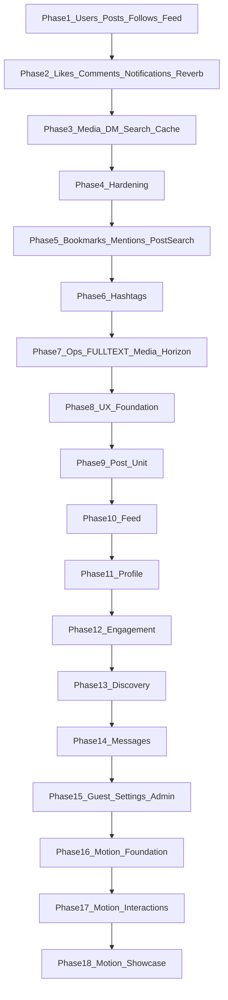

# Module map — folder & file blueprint by phase

Living blueprint of **paths to create or extend** for PLT Học Bá, derived from [`../SRS.md`](../SRS.md). Status of implementation lives in [`../PROGRESS.md`](../PROGRESS.md).

**Do not** create empty stubs for later phases. Add real files only when that phase is active.

Related: [`overview.md`](./overview.md) · SRS §4–§8 · open defaults SRS §10.

---

## Legend

| Marker | Meaning |
|--------|---------|
| `(new)` | Create this file when the phase is implemented |
| `(extend)` | Edit an existing starter-kit / earlier-phase file |
| `(remove/redirect)` | Replace or redirect away (e.g. placeholder dashboard) |
| `[P1]` / `[P2]` / `[P3]` | Phase when the path first appears |

**Wayfinder:** do not hand-edit `resources/js/actions/**` or `resources/js/routes/**` — regenerate after new routes.

**Naming locked (SRS §4.4 / §10):**

| Topic | Choice |
|-------|--------|
| Profile URL | `/u/{username}` |
| Home feed | Auth Home/Feed (`/feed`); replace placeholder `dashboard` |
| Follows | Explicit `Follow` model; unique `(follower_id, following_id)` |
| Soft deletes | Posts + comments |
| Feed pagination | Cursor, 15 per page |
| Admin RBAC | `role` column (`user` \| `admin`); controllers under `Admin/` |
| Max images (P3) | 6 |
| DM gate | Mutual follow required |

---

## Phase dependency



Implement Phase N only after Phase N−1 exit criteria are met (unless the user overrides).

---

## Baseline keep (do not replace)

Fortify auth, settings, passkeys/2FA, AppShell/sidebar, shadcn `components/ui/*`, Wayfinder-generated helpers.

**Extend in Phase 1:**

| Path | Role |
|------|------|
| `app/Models/User.php` | Social fields + relations |
| `app/Actions/Fortify/CreateNewUser.php` | Unique `username` |
| `app/Http/Requests/Settings/ProfileUpdateRequest.php` | Profile fields |
| `app/Http/Controllers/Settings/ProfileController.php` | Avatar/cover/bio |
| `app/Concerns/ProfileValidationRules.php` | Username/bio rules |
| `app/Providers/AppServiceProvider.php` | Policies if needed |
| `routes/web.php` | Feed, profile, follows |
| `resources/js/components/app-sidebar.tsx` | Home / Profile nav |
| `resources/js/pages/auth/register.tsx` | Username field |
| `resources/js/pages/settings/profile.tsx` | Social profile fields |
| `resources/js/types/auth.ts` | Shared user shape |
| `database/factories/UserFactory.php` | Username, role, etc. |
| `tests/Feature/Auth/RegistrationTest.php` | Username coverage |

---

## Phase 1 — Core foundation & social graph

MVP: identity fields, posts CRUD, follow graph, newsfeed, minimal admin. Spec: SRS §4.

### File tree

```text
database/
  migrations/
    *_add_social_fields_to_users_table.php          [P1](new)
    *_create_posts_table.php                        [P1](new)
    *_create_follows_table.php                      [P1](new)
  factories/
    UserFactory.php                                 [P1](extend)
    PostFactory.php                                 [P1](new)
  seeders/
    DatabaseSeeder.php                              [P1](extend)
    DemoSocialSeeder.php                            [P1](new)  # local learning-community demo
    LearningCommunityCatalog.php                    [P1](extend)
    Support/DemoMediaDownloader.php                 [P1](extend)
    data/learning_members.php                       [P1](extend)
    data/learning_posts.php                         [P1](extend)
    data/learning_images.php                        [P1](extend)

app/
  Models/
    User.php                                        [P1](extend)
    Post.php                                        [P1](new)
    Follow.php                                      [P1](new)
  Enums/
    UserRole.php                                    [P1](new)
  Services/
    FeedService.php                                 [P1](new)
  Policies/
    PostPolicy.php                                  [P1](new)
    UserPolicy.php                                  [P1](new)
  Http/
    Controllers/
      FeedController.php                            [P1](new)
      PostController.php                            [P1](new)
      ProfileController.php                         [P1](new)
      FollowController.php                          [P1](new)
      Admin/
        UserController.php                          [P1](new)
        PostController.php                          [P1](new)
    Requests/
      StorePostRequest.php                          [P1](new)
      UpdatePostRequest.php                         [P1](new)
      UpdateSocialProfileRequest.php                [P1](new)
      FollowUserRequest.php                         [P1](new)  # optional
  Actions/Fortify/
    CreateNewUser.php                               [P1](extend)
  Concerns/
    ProfileValidationRules.php                      [P1](extend)
  Providers/
    AppServiceProvider.php                          [P1](extend)

routes/
  web.php                                           [P1](extend)
  admin.php                                         [P1](new)

resources/js/
  pages/
    feed/index.tsx                                  [P1](new)
    profile/show.tsx                                [P1](new)
    profile/followers.tsx                           [P1](new)
    profile/following.tsx                           [P1](new)
    admin/users/index.tsx                           [P1](new)
    admin/posts/index.tsx                           [P1](new)
    admin/dashboard.tsx                             [P4](new)
    settings/profile.tsx                            [P1](extend)
    auth/register.tsx                               [P1](extend)
    auth/register-closed.tsx                        [P30](new)
    dashboard.tsx                                   [P1](remove/redirect)
  components/
    posts/
      post-card.tsx                                 [P1](new)
      post-composer.tsx                             [P1](new)
      post-form.tsx                                 [P1](new)
    profile/
      profile-header.tsx                            [P1](new)
      follow-button.tsx                             [P1](new)
      follow-list.tsx                               [P1](new)
    app-sidebar.tsx                                 [P1](extend)
    admin/admin-sidebar.tsx                         [P31](new)
    admin/admin-header.tsx                          [P31](new)
    admin/admin-pagination.tsx                      [P31](new)
  types/
    post.ts                                         [P1](new)
    profile.ts                                      [P1](new)
    auth.ts                                         [P1](extend)

tests/Feature/
  Auth/RegistrationTest.php                         [P1](extend)
  Feed/FeedTest.php                                 [P1](new)
  Posts/PostAuthorizationTest.php                   [P1](new)
  Follows/FollowConstraintsTest.php                 [P1](new)
  Profile/PublicProfileTest.php                     [P1](new)
  Admin/AdminModerationTest.php                     [P1](new)
```

### Schema reminders (SRS §4.3)

- **users:** `username` (unique), `bio`(160), `avatar_path`, `cover_path`, `role` default `user`
- **posts:** `user_id`, `body`, `image_path` nullable, soft deletes; indexes `(user_id, created_at)`, `created_at`
- **follows:** `follower_id`, `following_id`, unique pair; no self-follow

### Phase 1 routes (indicative)

| Surface | Method / path | Controller | Inertia page |
|---------|---------------|------------|--------------|
| Home feed | `GET /feed` | `FeedController@index` | `feed/index` |
| Create post | `POST /posts` | `PostController@store` | — (redirect/partial) |
| Edit post | `PUT/PATCH /posts/{post}` | `PostController@update` | — |
| Delete post | `DELETE /posts/{post}` | `PostController@destroy` | — |
| Public profile | `GET /u/{username}` | `ProfileController@show` | `profile/show` |
| Followers | `GET /u/{username}/followers` | `ProfileController@followers` | `profile/followers` |
| Following | `GET /u/{username}/following` | `ProfileController@following` | `profile/following` |
| Follow | `POST /u/{username}/follow` | `FollowController@store` | — |
| Unfollow | `DELETE /u/{username}/follow` | `FollowController@destroy` | — |
| Admin users | `GET /admin/users` (`?q=`) | `Admin\UserController@index` | `admin/users/index` |
| Admin create user | `POST /admin/users` | `Admin\UserController@store` | — |
| Admin suspend | `PATCH /admin/users/{user}` | `Admin\UserController@update` | — |
| Admin posts | `GET /admin/posts` (`?q=`, `?status=`) | `Admin\PostController` | `admin/posts/index` |
| Admin approve post | `PATCH /admin/posts/{post}/approve` | `Admin\PostController@approve` | — |
| Admin reject post | `PATCH /admin/posts/{post}/reject` | `Admin\PostController@reject` | — |

Auth: `auth` + `verified` on social routes; admin routes additionally require `role=admin`.

---

## Phase 2 — Engagement & real-time

Likes, one-level comments, DB notifications + Reverb. Spec: SRS §5.

### File tree

```text
database/
  migrations/
    *_create_likes_table.php                        [P2](new)
    *_create_comments_table.php                     [P2](new)
    *_create_notifications_table.php                [P2](new)

app/
  Models/
    Like.php                                        [P2](new)
    Comment.php                                     [P2](new)
    Post.php                                        [P2](extend)
    User.php                                        [P2](extend)
  Policies/
    CommentPolicy.php                               [P2](new)
  Http/
    Controllers/
      LikeController.php                            [P2](new)
      CommentController.php                         [P2](new)
      NotificationController.php                    [P2](new)
      PostController.php                            [P2](extend)  # show
    Requests/
      StoreCommentRequest.php                       [P2](new)
    Middleware/
      HandleInertiaRequests.php                     [P2](extend)  # unread count share
  Notifications/
    UserFollowedNotification.php                    [P2](new)
    PostLikedNotification.php                       [P2](new)
    CommentCreatedNotification.php                  [P2](new)
  Events/
    UserFollowed.php                                [P2](new)
    PostLiked.php                                   [P2](new)
    CommentCreated.php                              [P2](new)

routes/
  web.php                                           [P2](extend)
  channels.php                                      [P2](new)

config/
  broadcasting.php                                  [P2](new/extend)
  reverb.php                                        [P2](new)

resources/js/
  pages/
    posts/show.tsx                                  [P2](new)
    notifications/index.tsx                         [P2](new)
  components/
    posts/
      like-button.tsx                               [P2](new)
      comment-list.tsx                              [P2](new)
      comment-form.tsx                              [P2](new)
      post-card.tsx                                 [P2](extend)  # counts / like
    notifications/
      notification-bell.tsx                         [P2](new)
      notification-list.tsx                         [P2](new)
    app-sidebar.tsx / app-header.tsx                [P2](extend)
  hooks/
    use-conversation-realtime.ts                    [P3](extend)  # Firebase or Echo
  lib/
    firebase.ts / firebase-auth.ts / realtime.ts    # Firebase RTDB adapters
  echo.ts                                           [P2](new)  # Reverb local
  types/
    comment.ts                                      [P2](new)
    notification.ts                                 [P2](new)

tests/Feature/
  Likes/LikeToggleTest.php                          [P2](new)
  Comments/CommentTest.php                          [P2](new)
  Notifications/NotificationTest.php                [P2](new)
```

### Schema reminders (SRS §5.3)

- **likes:** unique `(user_id, post_id)`
- **comments:** `parent_id` nullable; one-level only; soft deletes recommended
- **notifications:** Laravel `notifications` table + broadcast channel

### Phase 2 routes (indicative)

| Surface | Method / path | Controller | Inertia page |
|---------|---------------|------------|--------------|
| Post detail | `GET /posts/{post}` | `PostController@show` | `posts/show` |
| Like toggle | `POST/DELETE /posts/{post}/like` | `LikeController` | — (JSON/partial) |
| Add comment | `POST /posts/{post}/comments` | `CommentController@store` | — |
| Delete comment | `DELETE /comments/{comment}` | `CommentController@destroy` | — |
| Notifications | `GET /notifications` | `NotificationController@index` | `notifications/index` |
| Mark read | `PATCH /notifications/...` | `NotificationController` | — |
| Broadcast auth | `/broadcasting/auth` | Laravel | private `App.Models.User.{id}` |

---

## Phase 3 — Advanced features & performance

Multi-image media pipeline, 1:1 chat, search/explore, Redis/cache/indexes. Spec: SRS §6.

### File tree

```text
database/
  migrations/
    *_create_post_media_table.php                   [P3](new)
    *_migrate_and_drop_posts_image_path.php         [P3](new)
    *_create_conversations_table.php                [P3](new)
    *_create_conversation_participants_table.php    [P3](new)
    *_create_messages_table.php                     [P3](new)
    *_add_hot_path_indexes.php                      [P3](new)

app/
  Models/
    PostMedia.php                                   [P3](new)
    Conversation.php                                [P3](new)
    Message.php                                     [P3](new)
    Post.php                                        [P3](extend)
    User.php                                        [P3](extend)
  Jobs/
    ProcessPostMediaJob.php                         [P3](new)
  Services/
    FeedService.php                                 [P3](extend)
    ExploreService.php                              [P3](new)
    SearchService.php                               [P3](new)
    ConversationService.php                         [P3](new)
  Policies/
    ConversationPolicy.php                          [P3](new)
    MessagePolicy.php                               [P3](new)
  Http/
    Controllers/
      ExploreController.php                         [P3](new)
      SearchController.php                          [P3](new)
      ConversationController.php                    [P3](new)
      MessageController.php                         [P3](new)
      PostController.php                            [P3](extend)  # multi media
    Requests/
      StorePostRequest.php                          [P3](extend)
      StoreMessageRequest.php                       [P3](new)
  Events/
    MessageSent.php                                 [P3](new)
    UserTyping.php                                  [P3](new)

routes/
  web.php                                           [P3](extend)
  channels.php                                      [P3](extend)

resources/js/
  pages/
    explore/index.tsx                               [P3](new)
    search/index.tsx                                [P3](new)
    messages/index.tsx                              [P3](new)
    messages/show.tsx                               [P3](new)
    feed/index.tsx                                  [P3](extend)
  components/
    posts/
      media-carousel.tsx                            [P3](new)
      media-uploader.tsx                            [P3](new)
      post-card.tsx                                 [P3](extend)
    messages/
      conversation-list.tsx                         [P3](new)
      message-thread.tsx                            [P3](new)
      message-composer.tsx                          [P3](new)
      typing-indicator.tsx                          [P3](new)
    app-sidebar.tsx                                 [P3](extend)  # Explore, Messages
  types/
    media.ts                                        [P3](new)
    message.ts                                      [P3](new)

tests/Feature/
  Media/PostMediaTest.php                           [P3](new)
  Messages/MessagingTest.php                        [P3](new)
  Explore/ExploreTest.php                           [P3](new)
  Search/UserSearchTest.php                         [P3](new)
```

### Schema reminders (SRS §6.3)

- **post_media:** `post_id`, `path`, `position`, optional width/height; max 6 images
- **conversations / messages:** dropped in Phase 40 — 1:1 chat lives on Firebase RTDB (`{minUid}_{maxUid}`). See ADR 0020.

### Phase 3 routes (indicative)

| Surface | Method / path | Controller | Inertia page |
|---------|---------------|------------|--------------|
| Explore | `GET /explore` | `ExploreController@index` | `explore/index` |
| Search | `GET /search` | `SearchController@index` | `search/index` |
| Inbox | `GET /messages` | `ConversationController@index` | `messages/index` |
| Thread | `GET /messages/{conversation}` | `ConversationController@show` | `messages/show` |
| Send message | `POST /messages/{conversation}` | `MessageController@store` | — |
| Start DM | `POST /messages` | `ConversationController@store` | — |

Private conversation channels for message + typing events (Reverb).

---

## Product surface map (all phases)

Aligned with SRS §8.

| Surface | Phase | Auth | Page path |
|---------|-------|------|-----------|
| Welcome | 1 | Guest | `welcome` (existing) |
| Auth (Fortify) | 1 | Guest/User | `auth/*` (existing) |
| Home Feed | 1 | User | `feed/index` |
| Public profile | 1 | User | `profile/show` |
| Settings profile | 1 | User | `settings/profile` (extend) |
| Admin moderation | 1 | Admin | `admin/users|posts/index` |
| Notifications | 2 | User | `notifications/index` + bell |
| Post detail | 2 | User | `posts/show` |
| Explore | 3 | User | `explore/index` |
| Search | 3 | User | `search/index` |
| Messages | 3 | User | `messages/index`, `messages/show` |
| Admin dashboard | 4 | Admin | `admin/dashboard` |
| Admin failed jobs | 4 | Admin | `admin/failed-jobs/index` |

---

## Phase 4 — Hardening & product readiness

```
app/
  Models/AdminAuditLog.php
  Services/AdminAuditLogger.php
  Services/AdminMetricsService.php
  Support/StructuredLog.php
  Http/Controllers/Admin/DashboardController.php
  Http/Controllers/Admin/FailedJobController.php

database/migrations/
  2026_08_08_300001_create_admin_audit_logs_table.php

resources/js/pages/admin/
  dashboard.tsx
  failed-jobs/index.tsx

docs/design/
  003-phase4-ops.md
```

Throttle named limiters registered in `AppServiceProvider`; applied on write routes in `routes/web.php`.

---

## Phase 5 — Engagement depth

```
app/
  Models/Bookmark.php
  Models/Mention.php
  Services/MentionService.php
  Http/Controllers/BookmarkController.php
  Notifications/UserMentionedNotification.php

database/migrations/
  2026_08_09_400001_create_bookmarks_table.php
  2026_08_09_400002_create_mentions_table.php

resources/js/
  pages/bookmarks/index.tsx
  components/posts/bookmark-button.tsx
  lib/mentions.tsx

docs/design/
  004-phase5-mentions-bookmarks.md
```

Routes: `GET /bookmarks`, `POST|DELETE /posts/{post}/bookmark`, search `tab=posts`.

---

## Phase 6 — Hashtags & topic discovery

```
app/
  Models/Tag.php
  Services/HashtagService.php
  Http/Controllers/TagController.php

database/migrations/
  2026_08_09_500001_create_tags_table.php
  2026_08_09_500002_create_post_tag_table.php

resources/js/
  pages/tags/show.tsx
  lib/rich-text.tsx

docs/design/
  005-phase6-hashtags.md
```

Routes: `GET /t/{slug}`, explore `trending_tags`, search `tab=tags`.

---

## Phase 7 — Ops: FULLTEXT + media disk + Horizon

```
app/
  Support/MediaDisk.php
  Services/SearchService.php          (extend — FULLTEXT branch)
  Jobs/ProcessPostMediaJob.php        (extend — get/put, no path())
  Providers/HorizonServiceProvider.php

config/
  filesystems.php                     (extend — media disk name)
  horizon.php

database/migrations/
  2026_08_09_700001_add_fulltext_index_to_posts_body.php

docs/design/
  006-phase7-ops.md
docs/decisions/
  0005-phase7-ops.md
```

Env: `MEDIA_DISK`, `AWS_*`; worker: `php artisan horizon`; dashboard `/horizon` (admin).

---

## Phase 8 — UX foundation

```
resources/css/app.css                         (extend — social blue tokens)
resources/js/layouts/app-layout.tsx           (extend — social default)
resources/js/layouts/app/app-social-layout.tsx (new)
resources/js/components/social/
  social-top-bar.tsx
  social-left-rail.tsx
  social-right-rail.tsx
  empty-state.tsx
  post-skeleton.tsx
  confirm-dialog.tsx

docs/design/007-ux-foundation.md
docs/decisions/0006-facebook-like-ux-chrome.md
```

---

## Phases 9–15 — UX surfaces (extend existing pages/components)

| Phase | Primary touch points |
|-------|----------------------|
| 9 | `components/posts/*` |
| 10 | `pages/feed/index.tsx` |
| 11 | `pages/profile/*`, `components/profile/*` |
| 12 | `pages/posts/show`, `notifications/*`, `bookmarks/*`, bell |
| 13 | `pages/search`, `explore`, `tags`, right rail |
| 14 | `pages/messages/*`, `components/messages/*` |
| 15 | `welcome`, `pages/auth/*`, `settings/*`, `admin/*` |

---

## Phase 16–18 — Motion

```
resources/js/components/motion/
  motion-provider.tsx
  fade-in.tsx
  stagger.tsx
  use-prefers-reduced-motion.ts
  page-transition.tsx

resources/css/app.css          (extend — motion tokens + shimmer)
package.json                   (add motion)

docs/design/
  015-motion-foundation.md
  016-motion-interactions.md
  017-motion-showcase.md
docs/decisions/
  0007-motion-showcase.md

---

## Phase 19 — Messages UX depth

```
resources/js/layouts/app/
  app-messages-layout.tsx

resources/js/pages/messages/
  index.tsx                 (empty inbox only when no chats)
  show.tsx                  (full-width split + search/unread)

resources/js/components/messages/
  message-thread.tsx        (auto-scroll + New messages chip)
  message-composer.tsx      (autofocus + image preview)

app/Http/Controllers/
  ConversationController.php  (index redirect + unread_count)

docs/design/
  018-messages-ux.md
docs/decisions/
  0008-messages-auto-open.md
```

---

## Phase 29 — Messages mobile UX

```
resources/js/layouts/app/
  app-messages-layout.tsx       (immersiveMobile on show)

resources/js/components/social/
  social-chrome-shell.tsx       (immersiveMobile: hide top bar <md)
  social-mobile-nav.tsx         (Messages → ?inbox=1)

resources/js/pages/messages/
  index.tsx                     (ConversationList + NewMessageSheet)
  show.tsx                      (chevron back, visualViewport inset)

resources/js/components/messages/
  conversation-inbox.tsx        (title + compose + pill search + rows)
  new-message-button.tsx        (sheet mobile / dialog desktop)
  message-composer.tsx          (no mobile autofocus; 44px targets)

resources/js/components/emoji/
  emoji-picker-button.tsx       (Sheet on mobile)

resources/js/hooks/
  use-visual-viewport.ts

docs/design/
  027-messages-mobile.md
docs/decisions/
  0008-messages-auto-open.md    (amended)
```

---

## Phase 21 — Notification badges

```
resources/js/components/notifications/
  unread-badges-provider.tsx
  notification-bell.tsx

resources/js/components/social/
  social-chrome-shell.tsx   (wrap UnreadBadgesProvider)
  social-left-rail.tsx
  social-mobile-nav.tsx

app/Events/
  UnreadBadgesUpdated.php

app/Services/
  UnreadBadgeBroadcaster.php

app/Listeners/
  BroadcastUnreadBadgesOnNotification.php

app/Http/Controllers/
  MessageController.php
  ConversationController.php
  NotificationController.php

docs/design/
  020-notification-badges.md
```

---

## Phase 22 — Emoji + stickers

```
resources/js/lib/
  emoji.ts

resources/js/components/emoji/
  emoji-picker-button.tsx

resources/js/components/messages/
  message-composer.tsx
  message-thread.tsx

resources/js/components/posts/
  post-composer.tsx
  post-body.tsx
  comment-form.tsx
  comment-list.tsx

docs/design/
  021-emoji-stickers.md
```

---

## Phase 23 — Post composer dialog

```
resources/js/components/posts/
  post-composer-shell.tsx
  post-composer.tsx
  post-card.tsx
  media-uploader.tsx

docs/design/
  022-post-composer.md
```

---

## Safe post markdown (ADR 0011)

```
app/Rules/SafePostMarkdown.php
app/Http/Requests/StorePostRequest.php   (body + SafePostMarkdown)
app/Http/Requests/UpdatePostRequest.php

resources/js/lib/
  post-markdown.tsx   (react-markdown + rehype-sanitize + @/#)
  rich-text.tsx

resources/js/components/posts/
  post-body.tsx
  post-composer-shell.tsx

docs/decisions/
  0011-safe-post-markdown.md
```

---

## Phase 28 — Facebook-like share post

```
database/migrations/
  *_add_shared_post_id_to_posts_table.php
  *_add_shared_post_id_to_messages_table.php

app/Models/Post.php                    (sharedPost, shares, shareRoot)
app/Models/Message.php                 (sharedPost)
app/Http/Controllers/PostShareController.php
app/Http/Controllers/ShareRecipientController.php
app/Http/Requests/StoreSharePostRequest.php
app/Http/Requests/SharePostMessageRequest.php
app/Notifications/PostSharedNotification.php
app/Support/PostPresenter.php          (shares_count, shared_post)
app/Services/FeedService.php           (eager sharedPost)

resources/js/components/posts/
  share-menu.tsx
  share-post-dialog.tsx
  share-to-message-dialog.tsx
  shared-post-embed.tsx
  post-card.tsx

docs/decisions/0013-post-share.md
docs/design/026-post-share.md
```

---

## Out of scope (do not create folders for)

Per SRS §1.4 unless a later ADR changes this:

- Groups / communities / pages
- Stories / reels / short video
- Ads / monetization
- Public GraphQL API
- Multi-tenant organizations
- Native mobile apps
- Spatie Permission (or similar) — use simple `role` until an ADR says otherwise
- Who-shared modal / external share sheets (Phase 28 non-goals)

---

## When to update this doc

- A phase introduces a new top-level module path not listed here
- Route/page naming diverges from this blueprint (update both this file and SRS if product-facing)
- An ADR reverses a locked naming choice above
